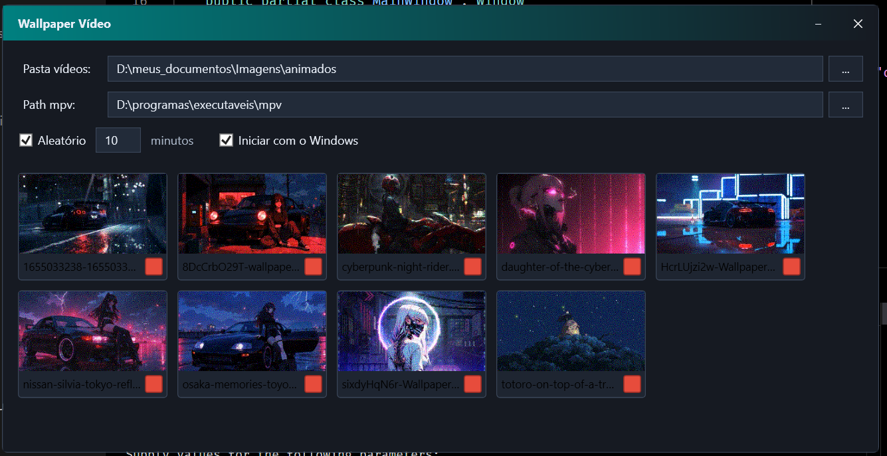

# Wallpaper vídeo



## Dependências

Precisa do [mpv](https://mpv.io/)

# Thumbnail

```ps1
& "D:\programas\executaveis\mpv\mpv.com" "D:\meus_documentos\six...4.mp4" --start=5 --frames=1 --vo=image --vo-image-format=jpg --vo-image-outdir="D:\meus_documentos\..." --no-config --no-audio --vf=scale=320:-1
```

# Gif

```ps1
& "D:\programas\executaveis\mpv\mpv.com" "D:\meus_documentos\Imagens\animados\16550...er.mp4" `
  --start=5 --length=3 `
  --no-config --no-audio `
  --vf=scale=320:-1 `
  --o="D:\meus_documentos\Imagens\animados\preview.gif" `
  --of=gif
```

# Wallpaper vídeo

```ps1
& "D:\programas\executaveis\mpv\mpv.exe" --wid=0 --vo=gpu --hwdec=auto --loop-file=inf --no-audio "D:\...Wallpaper2P..4.mp4"
```

# Publish

```ps1
dotnet publish -c Release
```

# Urls

- [mpv](https://mpv.io/)